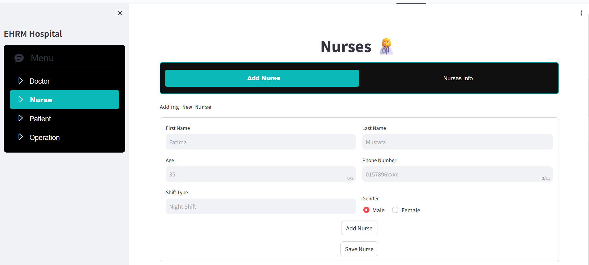
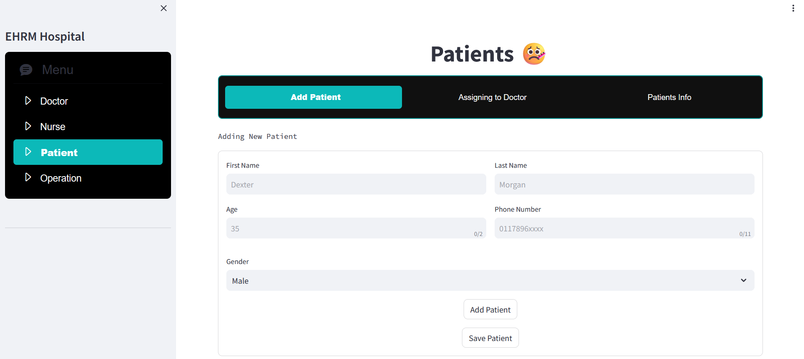
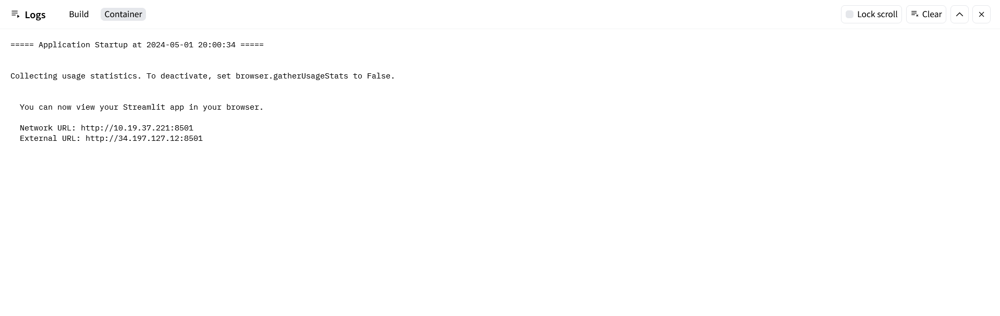

## Doctor Record Insertion🧑‍⚕️

## Nurse Record Insertion 👩‍⚕️

## Patient Record Insertion 😷

## Packages & Dependencies

Run Command 🚀 : pip install -r requirements.txt

## Run StreamLit Web App

Run Command 🚀 : streamlit run app.py

## That's it you can see the app running on the network / external url as like above..🔗

